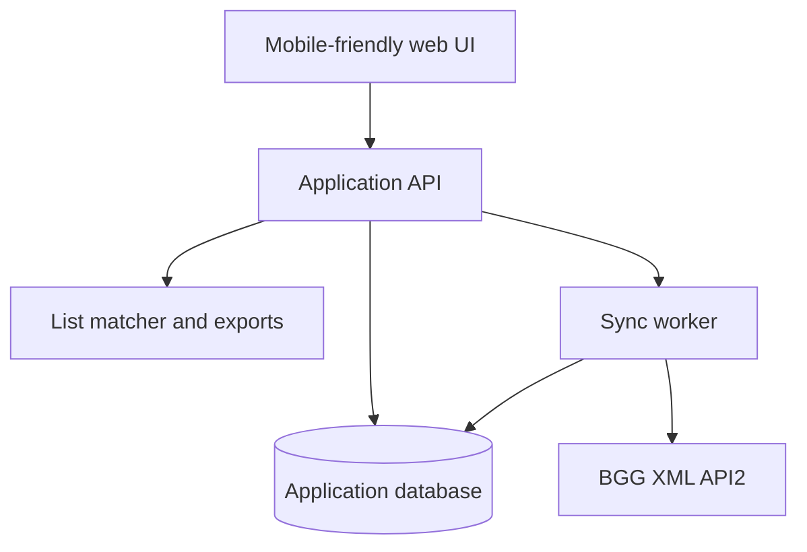

# BoardGameEngine Project Charter

**Status:** Draft for validation  
**Version:** 0.1  
**Date:** 2026-08-24

## 1. Purpose

BoardGameEngine will be a mobile-friendly, collection-first decision tool layered on top of BoardGameGeek (BGG). It should make it fast to choose an appropriate game from a real library and easier to prepare, compare, and share trade inventory.

The project begins from a common mismatch: a publisher's printed player range says a game *can* support a table size, while community experience may show that it does not work well there. BGG contains a useful Best / Recommended / Not Recommended poll for each player count, but its display and filtering do not always answer the user's practical question. The linked community discussion demonstrates several legitimate interpretations: some people combine Best and Recommended into positive sentiment; some avoid any count with a sizable Not Recommended share; and others want the complete distribution rather than a single label.

BoardGameEngine will preserve that information, explain how it ranks games, and let the user tune how conservative it should be.

## 2. Vision

> Given the people and constraints at the table, surface the five games from the user's collection that are most likely to fit—and make every recommendation explainable.

BoardGameEngine is not intended to replace BGG. BGG remains the system of record for game identity, community data, and the user's collection statuses. BoardGameEngine adds a faster decision layer, user-owned organization, and trade workflows.

## 3. Target user and jobs to be done

The initial target user is a board-game collector who already maintains a meaningful BGG collection but does not want to log plays.

### Before a game night

- “We have four people and want something medium-to-heavy. Give me five strong options from games we actually own.”
- Narrow by exact player count, community suitability, complexity, available time, and optional personal tags.
- Understand why each game was selected and what compromises it carries.

### While managing the collection

- Keep copy-specific trade details that BGG does not model conveniently for this workflow: edition, language, condition, completeness, notes, and availability.
- Export the current trade list as clean text, Markdown, or CSV without reformatting it by hand.

### While evaluating a trade or sale list

- Paste a list containing names, BGG URLs, or IDs.
- Compare resolved games against the user's wishlist and wishlist priorities.
- Separate confirmed matches from ambiguous names that need review; never silently guess an edition.

## 4. Goals and validation criteria

The following are proposed product acceptance targets, not assumptions about implementation technology:

1. A user can connect a BGG username, sync an owned collection, and see when the data was last refreshed.
2. A query with player count and weight returns up to five owned base games, ordered by exact-count community fit rather than only printed min/max players.
3. Every result explains its printed range, weight, time, Best / Recommended / Not Recommended shares, vote sample size, and any confidence or threshold adjustment.
4. If fewer than five games satisfy the constraints, the app says so and offers explicit relaxations; it never quietly violates a hard filter.
5. A for-trade owner can bulk-edit copy details and export the current set in one action.
6. A pasted list produces exact matches where possible, likely matches with confidence labels, and a manual-resolution queue for ambiguous titles or editions.
7. The product remains useful without recording a single play.

## 5. Non-goals for the initial project

- Play logging, statistics, streaks, challenges, or “shelf of shame” calculations based on plays.
- Replacing BGG as the canonical game database or collection editor.
- A marketplace, payment flow, shipping service, or automated valuation engine.
- Scraping BGG pages or relying on undocumented/private JSON endpoints.
- Training an AI or language model on BGG data.
- Public social-network features, reviews, forums, or universal game discovery in the MVP.
- Monetization before BGG's commercial-license implications are understood and approved.

## 6. Research findings

### 6.1 The community problem is real but the desired interpretation varies

The motivating [r/boardgames discussion](https://www.reddit.com/r/boardgames/comments/1qo0xax/an_issue_i_have_with_bgg_recommended_player_counts/) identifies an important presentation problem. If a poll is 12% Best, 43% Recommended, and 45% Not Recommended, BGG may emphasize the largest individual bucket even though 55% of votes are positive when Best and Recommended are combined. Other commenters reasonably argue that a 45% negative share is itself a serious warning.

Product conclusion: store and display all three counts. Treat “positive majority,” “low downside,” and “best at this count” as different signals. A ranking policy must be visible and configurable.

### 6.2 Supported BGG data path

The official [BGG XML API2 documentation](https://boardgamegeek.com/wiki/page/BGG_XML_API2) exposes the supported foundation:

| Need | Supported source | Relevant data or behavior |
|---|---|---|
| Identify games from pasted text | Search endpoint | Name search, exact search, BGG IDs, item type |
| Sync a user's library | Collection endpoint | Owned status, for-trade status, wishlist and priority, want/want-to-play/want-to-buy flags, ratings, versions, and optional statistics |
| Enrich games | Thing endpoint | Core metadata, links, images, community polls, and optional rating/rank statistics |
| Incremental refresh | Collection `modifiedsince` | Returns additions and status changes, but not deletions; periodic full reconciliation is still required |
| Batch enrichment | Thing endpoint | At most 20 IDs per request |
| Collection availability | Collection response | A `202` means the export is queued and should be retried with delay |

The Thing payload includes the community player-count poll used for Best / Recommended / Not Recommended calculations. The first technical spike should capture representative live payloads and freeze them as test fixtures before designing the permanent schema.

The API also documents an expansion-classification quirk in collection responses. Base games and expansions should be fetched/reconciled deliberately rather than trusting the default subtype alone.

### 6.3 Access, licensing, and operational constraints

The current [Using the XML API guide](https://boardgamegeek.com/using_the_xml_api) says application registration and authorization are generally required. Approved applications receive a Bearer token. BGG recommends server-side requests, caching, and minimizing traffic; client-side use risks exposing the token. The guide also says registration approval may take a week or more.

The [XML API terms](https://boardgamegeek.com/wiki/page/XML_API_Terms_of_Use) limit the default license to non-commercial use, require BGG credit and a linked “Powered by BGG” logo in public-facing uses, prohibit AI/LLM training with the data, and allow the API or terms to change. Commercial use requires a separate license and may be denied if BGG considers the application competitive. BGG's private JSON endpoints are explicitly not a stable or generally licensed alternative.

Architecture consequences:

- Keep the BGG token only on the server and out of the browser, repository, logs, and exports.
- Cache normalized game and poll data; do not request BGG data on every page view.
- Add bounded retries and backoff for `202`, `500`, and `503` responses.
- Throttle sync work and batch Thing requests to 20 IDs or fewer.
- Run occasional full collection reconciliations because incremental sync cannot detect deletions.
- Put BGG attribution in the user interface from the first public build.
- Treat API approval and licensing posture as an early go/no-go gate.

## 7. Product scope

### 7.1 MVP: collection sync and game picker

- Connect a public BGG username and import owned base games separately from expansions.
- Normalize core game data: BGG ID, names, year, image, player range, playing time, age, weight, categories/mechanics, expansion relationships, community player-count poll, ratings/ranks, and freshness timestamp.
- Query with:
  - exact player count (required);
  - weight range (optional);
  - available time (optional);
  - include/exclude expansions and games marked for trade (explicit toggles);
  - optional personal tags, once available.
- Return up to five results with a concise “why this fits” explanation.
- Allow sorting or policy selection without hiding the raw poll distribution.
- Provide manual refresh with clear queued, failed, and last-synced states.

### 7.2 Trade inventory

- Treat a physical copy separately from the canonical game record.
- Track status, edition/version, language, condition, completeness, notes, location, and last-updated date.
- Import BGG's for-trade flag while preserving app-specific copy metadata.
- Support bulk marking and bulk editing.
- Export plain text, Markdown, and CSV with canonical BGG links.
- Provide a shareable view only after privacy and access-control decisions are made.

### 7.3 Wishlist/list matcher

- Accept pasted lines, CSV, and BGG URLs/IDs.
- Normalize whitespace and common annotations, then resolve exact BGG IDs first and names second.
- Compare resolved BGG IDs—not titles—against the synced wishlist.
- Show wishlist priority in the result.
- Require confirmation for multiple editions, same-name games, expansions, or low-confidence fuzzy matches.
- Allow export of matched, unmatched, and unresolved rows.

## 8. Recommendation model

### 8.1 Signals

For a game `g` and exact player count `p`, retain the raw poll votes:

- `B(g,p)`: Best votes
- `R(g,p)`: Recommended votes
- `N(g,p)`: Not Recommended votes
- `T(g,p) = B + R + N`: total votes

Derive—but never substitute for the raw values:

- positive share: `(B + R) / T`
- best share: `B / T`
- negative share: `N / T`
- confidence: a sample-size adjustment so a 90% result from 10 votes does not automatically outrank an 88% result from 1,000 votes

### 8.2 Hard eligibility before ranking

A result must satisfy all active hard filters:

1. It is in the selected collection pool.
2. The exact player count is within the publisher-supported range.
3. It fits the chosen weight and time ranges, if supplied.
4. It is the desired item type and is not excluded by collection status.

The community poll then ranks eligible games. This avoids calling a technically unsupported count “recommended” merely because of a malformed or sparse poll.

### 8.3 Policies to prototype

The default is intentionally undecided until it is tested against the owner's real collection. Prototype three transparent policies:

| Policy | Intent | Candidate behavior |
|---|---|---|
| Conservative | Avoid a disappointing table fit | Strongly penalize negative share and require a meaningful vote sample |
| Balanced | Reward broad positive sentiment | Combine Best + Recommended, use Best as a tie-breaker, and adjust for sample size |
| Exploratory | Show workable choices when the shelf is constrained | Keep all publisher-supported games but rank weak/divisive fits lower and label them |

A fourth “custom” policy can expose a maximum Not Recommended percentage, minimum positive percentage, and minimum vote count. The eventual default and thresholds are product decisions, not facts to assume from BGG.

### 8.4 Explanation contract

Each result should answer:

- Why did this game qualify?
- Why is it ranked above the next game?
- How many people voted at this player count?
- Is the result broadly positive, exceptionally “Best,” divisive, or low-confidence?
- Which filters would have to relax to see more choices?

## 9. Additional features worth considering (without play tracking)

1. **Saved table profiles.** Save recurring contexts such as “four-player strategy night,” “two-player weeknight,” or “family afternoon,” including player count, weight, time, and strictness.
2. **Combined group libraries.** Add friends' public BGG usernames, deduplicate games by BGG ID, show who owns each copy, and choose from everything physically available to the group.
3. **Shareable shortlist and table vote.** Send the five candidates to attendees so they can rank, veto, or mark rules familiarity before the event; the host retains the final decision.
4. **Collection coverage map.** Visualize where the collection is strong or thin across exact recommended player count, weight, and time—for example, “many heavy four-player choices, almost no reliable six-player games.” This uses catalog and poll data, not play history.

## 10. Proposed architecture (technology-neutral)

### Components

- **Web UI:** responsive picker, collection/trade management, list import review, exports, and sync status.
- **Application API:** authentication if needed, authorization, recommendation queries, personal metadata, and export generation.
- **BGG adapter and sync worker:** authenticated server-side calls, XML parsing, caching, backoff, batching, and full/incremental reconciliation.
- **Database:** normalized game facts and poll observations plus user-owned settings and copy metadata.
- **Matching pipeline:** line parsing, ID/URL extraction, exact search, fuzzy candidates, disambiguation, and wishlist comparison.

### Initial domain model

- `SourceAccount`: BGG username and sync state
- `Game`: canonical BGG identity and stable catalog fields
- `GamePollSnapshot`: raw player-count votes and fetch timestamp
- `CollectionItem`: BGG status flags, wishlist priority, personal rating, and version reference
- `Copy`: user-managed edition, condition, language, completeness, location, notes, and trade status
- `SavedProfile`: reusable picker filters and recommendation policy
- `ImportedList` / `ImportedRow`: original input, normalized input, resolution state, and selected BGG ID
- `SyncRun`: request counts, retries, outcome, and freshness

Technology selection is deferred to a short architecture spike. Selection criteria should include mobile ergonomics, a server-side secret boundary, durable scheduled/background work, relational queries, easy XML fixture testing, simple deployment, and low maintenance for a small project.

## 11. Delivery plan

### Milestone 0 — Feasibility and decisions

**Work**

- Register a non-commercial BGG application and request approval.
- Identify the test BGG username and confirm which collection fields are public.
- Capture representative Collection, Thing, Search, and queued `202` responses as sanitized fixtures.
- Validate the player-count poll structure, vote counts, expansion relationships, edition/version data, and API error behavior.
- Run the three scoring policies across a meaningful sample from the real collection.
- Decide the account model, recommendation default, public/private scope, and intended monetization.

**Exit criteria**

- BGG access and license posture are viable.
- The exact fields required for the MVP have test fixtures.
- A scoring approach produces credible five-game shortlists for several table scenarios.
- Open product decisions below have owners or explicit deferrals.

### Milestone 1 — Read-only collection MVP

**Work**

- Implement BGG adapter, XML parsing, throttled sync, cache, retries, and full reconciliation.
- Build normalized game, poll, collection, and sync-run storage.
- Build the mobile-first picker and transparent result explanations.
- Add freshness/error states and BGG attribution.
- Add contract tests against fixtures and scoring tests for edge cases.

**Exit criteria**

- A synced collection can answer player-count + weight + time queries reliably.
- Results remain reproducible for the same data and policy.
- Sparse polls, missing weights/times, expansions, and fewer-than-five results are handled explicitly.

### Milestone 2 — Trade inventory and exports

**Work**

- Add copy-specific fields, bulk editing, BGG for-trade reconciliation, and privacy controls.
- Add text, Markdown, and CSV export templates with stable BGG links.
- Add export tests for escaping, missing edition data, and multiple copies.

**Exit criteria**

- The owner can update and export the entire current trade list without manual reformatting.
- Re-syncing from BGG does not overwrite app-owned notes or copy metadata.

### Milestone 3 — Wishlist/list matcher

**Work**

- Parse pasted text, BGG links/IDs, and CSV.
- Resolve exact matches, rank candidate matches, and build the ambiguity-review UI.
- Compare by BGG ID to wishlist and priority; export results.

**Exit criteria**

- Exact identifiers are deterministic.
- Ambiguous names are never silently accepted.
- The user can correct a match and retain that resolution within the imported list.

### Milestone 4 — Selected enhancements and hardening

- Validate and prioritize saved profiles, combined collections, table voting, and the collection coverage map.
- Add accessibility, privacy/export/delete controls, observability, sync administration, and deployment runbooks.
- Consider installable PWA/offline read support only after the core online flows are stable.

## 12. Testing strategy

- **Contract fixtures:** sanitized official API payloads for normal, missing, queued, throttled, and malformed cases.
- **Parser tests:** collection status flags, expansions, version fields, polls, missing statistics, and HTML/XML entities.
- **Recommendation tests:** exact-count eligibility, hard-filter integrity, small samples, ties, divisive polls, missing polls, and deterministic ordering.
- **Matcher tests:** BGG URLs, numeric IDs, punctuation, alternate titles, duplicate names, editions, expansions, and intentionally unresolved rows.
- **Export snapshots:** plain text, Markdown, and CSV escaping across multiple copies and incomplete metadata.
- **End-to-end scenarios:** sync → pick five; update copies → export; paste list → review → wishlist matches.

## 13. Major risks and mitigations

| Risk | Impact | Mitigation / decision gate |
|---|---|---|
| BGG application approval or license denied | Blocks a public API-backed product | Apply during Milestone 0; keep the first use explicitly non-commercial; do not build on private APIs |
| API throttling, instability, or schema changes | Slow/broken sync | Server-side cache, batching, bounded retries, fixtures, adapter boundary, freshness UI |
| Incremental sync misses deletions | Stale collection | Scheduled full reconciliation plus on-demand refresh |
| Polls are sparse or biased | False precision | Show sample size and raw distribution; confidence adjustment; configurable policy |
| Weight conflates rules load and strategic depth | Poor “medium-heavy” fit for some users | Treat weight as a coarse filter; later add manual teach/brain-burn tags |
| Titles and editions are ambiguous | Incorrect wishlist matches | Prefer IDs/URLs, show candidates, and require confirmation |
| BGG and app statuses conflict | User loses trust or notes | Define field ownership; never overwrite app-owned copy data during sync |
| Scope expands into another BGG clone | Delayed useful release | Keep MVP centered on collection sync + picker; gate additional features by validation |

## 14. Open decisions—do not assume

These questions do not block writing the charter, but they do block parts of implementation:

1. What is the BGG username to use for discovery and acceptance testing?
2. Is the first release a private personal tool, a small invited-user app, or a public multi-user product?
3. Is there any intent to charge money, show ads, accept feature-linked donations, or support a commercial organization?
4. Should app-specific data live only in one browser/device, or should users sign in and sync it across devices?
5. For the default recommendation policy, should avoiding negative sentiment matter more than maximizing Best votes, or should the app begin balanced and let the user choose?
6. When a game is marked for trade, should the picker exclude it by default, include it with a badge, or use a saved preference?
7. Which one-click trade output matters most first: forum-ready Markdown, plain text for messages, CSV, a public link, or a BGG GeekList-compatible workflow?
8. Should the wishlist matcher compare only base-game identity at first, or must it distinguish editions, expansions, and language from day one?
9. Are friends' collections part of the intended early use, or a later enhancement?

## 15. Immediate next actions

1. Answer the open decisions that affect Milestone 0, especially BGG username, release audience, and monetization.
2. Submit the BGG application registration; approval may take time.
3. Create Milestone 0 issues for API fixtures, field mapping, scoring experiments, account model, and license/attribution requirements.
4. Test the three ranking policies against several real scenarios (for example 2, 4, and 6 players across light, medium, and heavy ranges).
5. Review the resulting five-game lists manually before selecting a stack or building the interface.

## 16. Sources

- [Motivating r/boardgames discussion](https://www.reddit.com/r/boardgames/comments/1qo0xax/an_issue_i_have_with_bgg_recommended_player_counts/)
- [BGG XML API2 documentation](https://boardgamegeek.com/wiki/page/BGG_XML_API2)
- [Using the BGG XML API: registration, tokens, limits, and public apps](https://boardgamegeek.com/using_the_xml_api)
- [BGG XML API Terms of Use](https://boardgamegeek.com/wiki/page/XML_API_Terms_of_Use)
- [BGG XML API commercial-use guidance](https://boardgamegeek.com/wiki/page/BGG_XML_API_Commercial_Use)
- [BGG JSON API warning](https://boardgamegeek.com/wiki/page/BGG_JSON_API)

